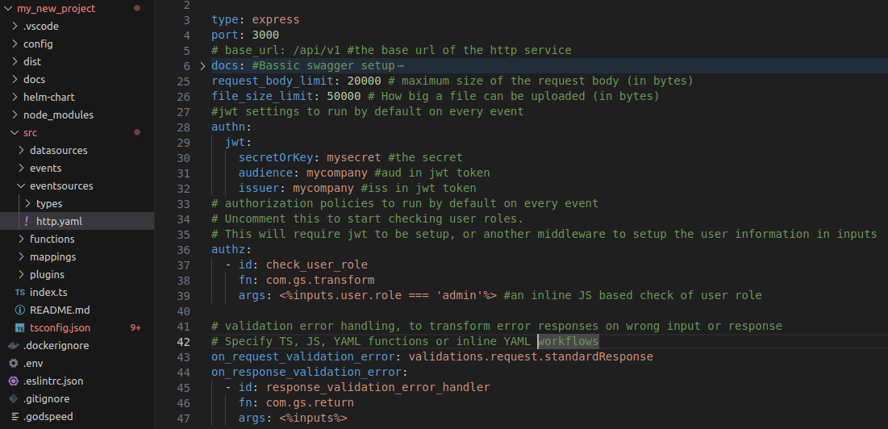

# Starting with Godspeed's meta-framework for Nodejs.

In this section, you will learn how to install the meta-framework using the command line interface (CLI) and how to either create a new project with the framework or (in case of an existing Nodejs project) integrate Godspeed into it.


### Pre-requisites:

1. Node 18 and npm
2. Git
3. VS Code or any code editor

### Quick start

```bash
  npm install -g @godspeedsystems/godspeed
  godspeed create my_new_project
  cd my_new_project
  npm i
  godspeed serve
  # open localhost:3000/api-docs ( as per default port and 
  # swagger endpoint as setup in eventsources/http.yaml)
```

<div style={{ position: 'relative', paddingBottom: '56.25%', height: 0, overflow: 'hidden' }}>
    <iframe style={{ position: 'absolute', top: 10, left: 10, width: '80%', height: '80%' }} src="https://www.youtube.com/embed/f1jlvaM7Sbo" frameborder="0" allow="fullscreen;" allowfullscreen ></iframe>
</div>

### Installation

Godspeed CLI is the command center of a Godspeed project. It allows you to create & manage your Godspeed project. It is shipped via [npm](https://www.npmjs.com/package/@godspeedsystems/godspeed). You can go ahead and install it using the below command.


```bash
   npm install -g @godspeedsystems/godspeed
```

_To know more about all CLI commands, [click here](../CLI#supported-commands--arguments)_


### Creating your project
You can create a new project like this.
```bash
  godspeed create <project_name>
```
> This may take some time to install the required npm plugins and create your project. Be patient!

#### Scaffolding of a meta-framework project
This will create a basic project with Express eventsource, a sample endpoint (event) and event handler function for the same. It will show you possible configurations of Express service with JWT authn and autorization workflows.



:::tip
To understand the general scaffolding structure of the project , Check [here](/docs/microservices-framework/getting-started/guide.md#the-project-scaffolding) 
:::

### Referencing pre-made project templates
Pre-made projects are a great place to start learning about the meta-framework. You can refer these pre-made examples to learn about different features of meta-framework, and reuse the code from there. Feel free to clone, refer and re-use the repos given below.

#### Basic Project

Repository - [Hello World](/docs/microservices-framework/getting-started/guide.md)

#### Full Stack App
A full stack app with Godspeed based backend and an embedded React project for frontend.

Repository - [With Godspeed and React](https://github.com/godspeedsystems/gs-node-templates/tree/master/FullStack_App_With_React).

#### Loan Origination System

A more complex fintech project with diverse use cases for issuing loans via multiple lenders, policies, loan offers, KYC, loan account creation etc in a microservice based design.

Repository - [Loan Origination System](https://github.com/godspeedsystems/gs-node-templates/tree/master/LOS). 

_Check the Readme.md and Setup.md files in this repo as it requires a docker container of Postgres and Kafka to be running. Dockerfile is provided in the project._

### Building and running your project

**Building** You can build your project using the `godspeed build` command. This transpiles the TS files and copies all the source code into `/dist` folder of your project.

**Clean**  With `godspeed clean` you can remove all pre-compiled files from your `/dist` folder. While build overrides `dist` everytime, `clean` command is useful if you have deleted some files in your `src` repo. When you delete something from `src`, it doesn't delete the files in the `dist`. You may need to clean up the dist folder to remove old references to deleted files in `src`

**Local development in auto-watch mode** You can start your server on localhost using `godspeed serve`. It will run the project in autowatch mode over your local file changes.

**Production deployment:** Build your project and then run `godspeed preview` to serve directly from the `dist` folder 

### For any help
Try running in the below command line to see available Godspeed commands. Refer [the full CLI spec](/docs/microservices-framework/CLI.md) for more information, including [how to add plugins for eventsources and datasources](../CLI#plugin)  


```bash
   godspeed --help
```
   
```bash
    
       ,_,   ╔════════════════════════════════════╗
      (o,o)  ║        Welcome to Godspeed         ║
     ({___}) ║    World's First Meta Framework    ║
       " "   ╚════════════════════════════════════╝


Usage: Godspeed CLI [options] [command]

CLI tool for godspeed framework.

Options:
  -V, --version                   output the version number
  -h, --help                      display help for command

Commands:
  create [options] <projectName>  create a new godspeed project.
  serve                           run godspeed development server.
  clean                           clean the previous build.
  gen-crud-api                    scans your prisma datasources and generate
                                  CRUD APIs events and workflows
  build                           build the godspeed project.
  plugin                          manage(add, remove, update) eventsource and
                                  datasource plugins for godspeed.
  prisma                          proxy to prisma commands with some add-on
                                  commands to handle prisma datasources.
  help [command]                  display help for command

    
```
